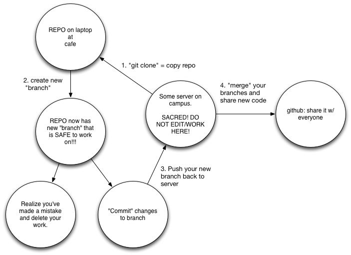

Why github is important for what we do.
========================================================
author: Kevin Thornton
date: April 2014

This talk can be found at https://github.com/ThorntonLab/intro2github

Reproducible research
========================================================

We typically have a problem with the following:
- Keeping track of our own code
- Keeping track of what version of someone else's code we are using
- Sharing examples of how to do things with our colleagues

All of the above leads to problems in reproducing the results from computational projects

Version control software is helpful
========================================================

- Allows us to keep track of changes over time.
- Most useful when the files are plain text

There are lots of different options (CVS,SVN, etc.).
Recently, [github](https://github.com) has become very popular.

What is github?
========================================================
It is a web front-end to git, which is version control software.  It has "social media"-like features.  One can follow other developers, "watch" their projects, etc.

Example acounts:
- http://github.com/molpopgen
- http://github.com/ThorntonLab

What do you get (for free)?
===
- Unlimited number of PUBLIC projects.  Anyone on the web can see these.
- As an academic, you may request 5 free PRIVATE projects from https://education.github.com
- You may create an organization and request 10 free PRIVATE projects.
- You may have an unlimited number of PUBLIC projects provided that each project's size is < 1GB.

Uses:
====
- Managing source code for your own projects.
- Managing scripts to perform common tasks on HPC.
- Write papers using LaTeX.
- Keeping track of the precise version used of OTHER projects hosted on git.
- Automatically backs up all of your scripts, etc., that you are developing on HPC!!!!

__This solves a lot of the problems that you are probably currently having__

Lab "Notebooks"
===
- [Rstudio](http://www.rstudio.com/)
- "R Markdown" generates html output automagically
- File -> New File -> R Markdown
- Keep plain-text output files in a git repo
- Use the R Markdown file to process your results
- You have an up-do-date web page telling you what state your project is in
- Keep it all in a git repo for version control

What problems do you have?
===
- file.py, file2.py, file2_bugfix.py, file2_bugfix2.py.  Which of these is the right one?
- Your HPC workflows have a zillion shell scripts all over the place, right?
- You have trouble finding examples of things that you have done before.
- You lost your notes on how to compile some critical tool that you use, or how to load a module on HPC, etc.

__Git solves all of the above.__

Nice things:
===
- You can write README files using the Markdown language.  This is "html-lite"
- README.md will be automatically displayed at bottom of project page online

Example: https://github.com/molpopgen/pecnv

- You can generate web pages in Markdown.  Karl Browman has a draft [tutorial](https://github.com/kbroman/simple_site).
- The websites can be for projects, individual, and/or lab groups
- Karl's [qtlcharts](http://github.com/kbroman/qtlcharts) package is a nice [example](http://kbroman.github.io/qtlcharts/).

More nice things:
===
- You can "fork" (copy) someone else's public project
- You can edit it and send a "pull request", meaning that the original author can see your __exact__ changes and incorporate them into the original project, if desired.
- You can have small examples of code in "gists", which are not full projects. These are _great_ for showing colleagues how to do various computational tasks. [Example](https://gist.github.com/molpopgen/9126441)

Terminology
===
- repo: the name of a project. 
- clone: make a copy of a repo
- branch: make a copy of the files within a repo.  E.g., make "bugfix" that is a copy of "master".  You can now work on "bugfix" and master _remains unchanged_.  __No more "cp file.pl file2.pl"!!__
- commit: make your changes permanent in the repo (on the current branch)
- merge: merge changes from branch B into A.  Example:
```
git merge bugfix master
```
- push: send your changes back to "origin". Example: 
```
git push origin master
```

How I do things.
===


Comment
===
The central "server" in the previous slide __SHOULD NOT__ be a laptop, as they typically do not have static IP addresses and/or hostnames.

Really, it should be a Unix workstation (Linux and OS X installations will typicall both have git on them).

It should __NOT__ be HPC.  Rather you should be __cloning__ to HPC from your server, and __pushing__ changes/bugfixes bac to your server from HPC.

Synology boxes
===

Check out this company: http://www.synology.com/
* Lighweight linux machine with an web interface for configuration
* Basically a minimal way to set up a RAID server
* Has capability of being a git server for your lab
* Emerson/Long/Thornton bought one together but have been too preoccupied to figure out how to set up the git features
* (Can also be your music/video/photo server at home, Time Machine device, etc.)

Helpful links
===
[Github "Help"](https://help.github.com/) -- See the "Bootcamp" section

[Branching and merging](http://git-scm.com/book/en/Git-Branching-Basic-Branching-and-Merging)

Example working from a server
===
```
#Clone repo
git clone kevin@devlaeminck.bio.uci.edu:~/git/libsequence.git
cd libsequence
#make branch and check it out
git branch bugfix
git checkout bugfix
#Fix the bug, test that is is fixed, etc...
git commit [list of changed files] -m "Message about what I changed"
#Push the bugfix branch back to github
git push origin bugfix
```

Then, back on my server, I can share changes via github.
===
```
cd ~/git/libsequence.git
#merge changes to "master"
git merge bugfix master
#push the changes back to github
git push origin master
```
Now, anyone "following" that project will see that changes have been made.

This seems convoluted, but:
===
- I can always work, even if github is down
- My repos are backed up when my server is backed up
- I can choose exactly __when__ to share on github

What if?
===

***
What if you "goof" and skip the path through your server? _E.g._, you go straight from a github repo and push back to github, leaving your __SACRED__ server version out of date?

No problem!  On your server:
```
cd path/to/repo
git pull origin master
```

Let's put this presentation online!
===
```
#In my github account, create repo intro2github
#On my server:
mkdir ~/git/intro2github.git
cd ~/git/intro2github.git
git init
git remote add origin https://github.com/molpopgen/intro2github.git
#Copy files to my server from laptop
rsync -avr ~/Dropbox/githubHOWTO/*.md ~/Dropbox/githubHOWTO/*.png $LINUXBOX:~/git/intro2github.git
#Back on my server
git add *.md *.png -m "new files added"
git push origin master
```
Tips and Tricks
===
The following slides are probably too much for an intro, but show how to do some more advanced git-related things.

Creating a "release"
===
When you publish, it is a good idea to make the __exact__ scripts available.  I do this by "tagging" the published version of the code with a particular release number:
```
git tag 0.1.0 -m "Corresponds to publication PMID 123456"
git push origin 0.1.0
```
Then, reponame-0.1.0.tar.gz can be downloaded from the "releases" link from the github page for the project.

Dealing with other people
===
Other projects may not do releases.  Rather, there may only be a "master" branch.  How can you tell anyone what version you used?  Easy--use ["submodules"](http://git-scm.com/docs/git-submodule) to freeze the version in time.
```
git submodule add https://github.com/samtools/samtools.git
```
Now, whatever code exists __RIGHT NOW__ in samtools is what you are using.  If there is an important bugfix, you can update your submodule (see above link).

Good practices = reproducible research
===
Git != reproducibility!  

Too many projects do not release version numbers, which is a __HUGE__ problem because results may not be reproducible.  See PACbio's [blasr](https://github.com/PacificBiosciences/blasr) project as an example of this problem.

When you organize your code, and make it public, be better than your average bioinformatician (honestly, that often just means writing a README in complete sentences and releasing a "tag" corresponding to the published version).
